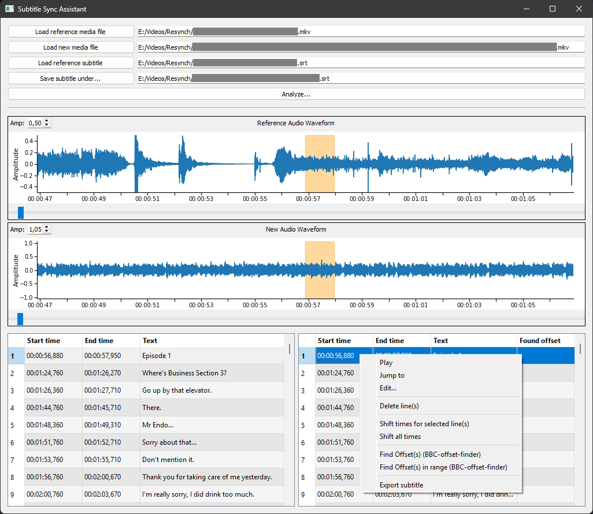

# Subtitle Sync Assistant



A small PyQt5 desktop tool to realign subtitle (`.srt`) files against a “reference” and a “new” media file by visual inspection and automatic audio offset detection.

## Purpose

Load one reference media file, one new media file, and an existing subtitle file; inspect both waveforms with subtitle bands; measure per?line offsets using audio correlation; adjust timings (edit or shift); export a corrected SRT.

## Personal Note

I wrote this tool by almost exclusively using the Github Copilot AI assistant. Even the readme was written by it. It was a fun experiment to see how far I could get with it.
The code is not perfect, but it works well enough for my own use cases. I hope it can be useful to others as well.
PS: No way we get AGI soon :)

## Main Features

- Dual waveform display (reference vs new) with subtitle interval highlighting
- Selection ? waveform highlight coupling
- Per?line audio playback and “jump to” navigation
- Edit individual subtitle line (start, end, text) with validation
- Shift times (selected or all) with visual highlight of modified rows
- Automatic per?line offset detection using BBC audio offset finder
- Range + sliding window mode for multi?line offset searches
- Export adjusted sync table to SRT (via context menu)

## Installation

Requirements:
- Python 3.13 (developed/tested with 3.13; 3.10+ likely fine)
- ffmpeg on PATH (needed by pydub for media decoding)

Required Python packages:
- PyQt5
- matplotlib
- numpy
- pydub
- pysrt
- audio-offset-finder (mandatory for offset detection)

Recommended install steps (Windows / PowerShell example):

```powershell
# Install Python 3.13+ from python.org

# Verify python and pip are in PATH and working
python --version
pip --version

# Install/upgrade required packages
pip install --upgrade pip setuptools
pip install PyQt5 matplotlib numpy pydub pysrt audio-offset-finder

# (Optional) Install ffmpeg using a package manager like scoop or choco, or download from ffmpeg.org

# Verify ffmpeg is in PATH and working
ffmpeg -version
```

## Run

From the project root (where `subtitle_sync_assistant.py` resides): python subtitle_sync_assistant.py

## Typical Workflow

1. Load reference media, new media, and the original subtitle.
2. Click “Analyze...” to populate waveform plots and tables.
3. (Optional) Select lines and run offset detection (“Find Offset(s)” or range/sliding variant).
4. Shift or edit lines as required.
5. Export the synchronized subtitle via the sync table context menu.

## Notes

- ffmpeg must be installed and discoverable on PATH.
- Offset accuracy depends on distinct audio regions.
- For very large subtitle sets a model/view rewrite could further improve performance.
- Only SRT format is currently supported.

## License

This program is free software: you can redistribute it and/or modify it under the terms of the GNU General Public License version 3 (GPLv3) as published by the Free Software Foundation.

You should have received a copy of the GNU GPL version 3 along with this program. If not, see: https://www.gnu.org/licenses/gpl-3.0.html

Because this application uses PyQt5 (GPL), the combined work must be distributed under GPLv3 (or later) and you may not impose additional restrictions (for example, you cannot make it “non?commercial only”). Users are free to run, study, modify, and redistribute the program under the GPL terms.

### Third?Party Components (summary)

- PyQt5 – GPLv3
- numpy – BSD 3-Clause
- matplotlib – Matplotlib (BSD-style) license
- pydub – MIT
- pysrt – LGPLv3
- audio-offset-finder – (check package metadata, typically permissive; include its license text)
- ffmpeg (runtime dependency) – LGPL or GPL depending on build options (if you redistribute binaries, provide corresponding license text)

