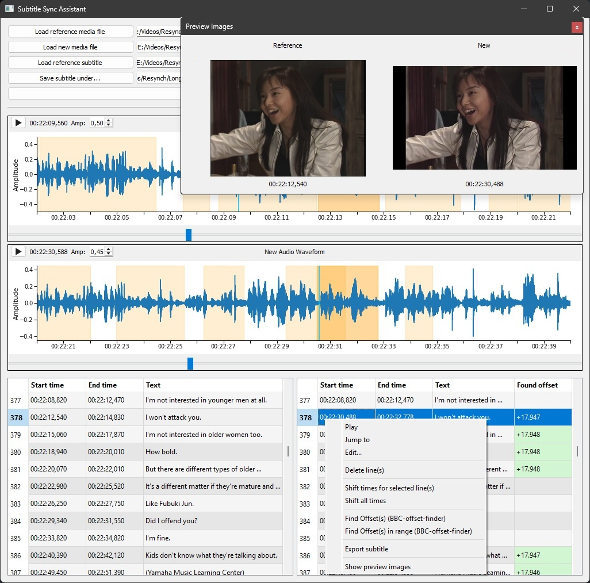

# Subtitle Sync Assistant



A small PyQt5 desktop tool to realign/synchronize subtitle (`.srt`) files against a “reference” and a “new” media file by visual inspection and automatic audio offset detection.

## Purpose

Making the process of synchronizing subtitles easier and faster.
For example: You have a video file with worse image quality but with subtitles and another video file with better image quality but no subtitles. You want to use the subtitles from the first video with the second video. However, the timings are slightly off (e.g. due to different intro/outro lengths or cuts). This tool helps you to quickly find and fix these timing issues.

## Personal Note

I wrote this tool by almost exclusively using the Github Copilot AI assistant. Even the readme was written by it. It was a fun experiment to see how far I could get with it.
The code is not perfect, but it works well enough for my own use cases. I hope it can be useful to others as well.

PS: No way we get AGI soon :)

PPS: Thank you to the BBC for their excellent audio-offset-finder

## Main Features

- Dual waveform display (reference vs new) with subtitle interval highlighting
- Audio playback and jump-to navigation
- Edit individual subtitle line (start, end, text)
- Shift times (selected or all) with visual highlight of modified rows
- Color coding of subtitle lines (unmodified, modified) with the following scheme:
  - White: unmodified
  - Yellow: modified (edit or shift)
  - Orange: offset detected
  - Red: invalid (end before start, empty text)
- Automatic offset detection using BBC audio offset finder
  - Global search: find each reference line within the entire NEW audio.
  - In-range search: enter a single search length in minutes (e.g., 0.5, 1.5). For each selected line the NEW search slice is [ref_start − L, ref_end + L] (clamped to media duration), while the reference snippet stays exactly [ref_start, ref_end].
- Preview images window that shows frames from both media files at the selected subtitle line times to help visually verify correct alignment
- SRT file Export

For a developer-oriented overview of the package layout and how modules interact, see README_STRUCTURE.md.

## Installation

Requirements:
- Python 3.13 (developed/tested with 3.13; 3.10+ likely fine)
- ffmpeg on PATH (needed by pydub for media decoding)

Required Python packages:
- PyQt5
- matplotlib
- numpy
- pydub
- pysrt
- audio-offset-finder (required for offset detection features)

Example setup (Windows / PowerShell):

```
# Install Python 3.10+ from python.org

# Verify python and pip are in PATH and working
python --version
pip --version

# Install/upgrade required packages
pip install --upgrade pip setuptools
pip install PyQt5 matplotlib numpy pydub pysrt audio-offset-finder

# (Optional) Install ffmpeg using a package manager like scoop or choco, or download from ffmpeg.org

# Verify ffmpeg is in PATH and working
ffmpeg -version
```

## Run

From the project root (where `subtitle_sync_assistant.py` resides): `python subtitle_sync_assistant.py`

## Typical Workflow

1. Load reference media, new media, and the original subtitle.
2. Click "Analyze..." to populate waveform plots and tables.
3. (Optional) Select lines and run offset detection ("Find Offset(s)" or range/sliding variant).
4. Shift or edit lines as required.
5. Export the synchronized subtitle via the sync table context menu.

## Notes

- ffmpeg must be installed and discoverable on PATH.
- Offset accuracy depends on distinct audio regions.
- For very large subtitle sets a model/view rewrite could further improve performance.
- Only SRT format is currently supported.

## License

This program is free software: you can redistribute it and/or modify it under the terms of the GNU General Public License version 3 (GPLv3) as published by the Free Software Foundation.

You should have received a copy of the GNU GPL version 3 along with this program. If not, see: https://www.gnu.org/licenses/gpl-3.0.html

Because this application uses PyQt5 (GPL), the combined work must be distributed under GPLv3 (or later) and you may not impose additional restrictions (for example, you cannot make it “non?commercial only”). Users are free to run, study, modify, and redistribute the program under the GPL terms.

### Third Party Components (summary)

- PyQt5 – GPLv3
- numpy – BSD 3-Clause
- matplotlib – Matplotlib (BSD-style) license
- pydub – MIT
- pysrt – LGPLv3
- audio-offset-finder - Apache License 2.0
- ffmpeg - LGPL 2.1+

See THIRD_PARTY_NOTICES.md for details.
